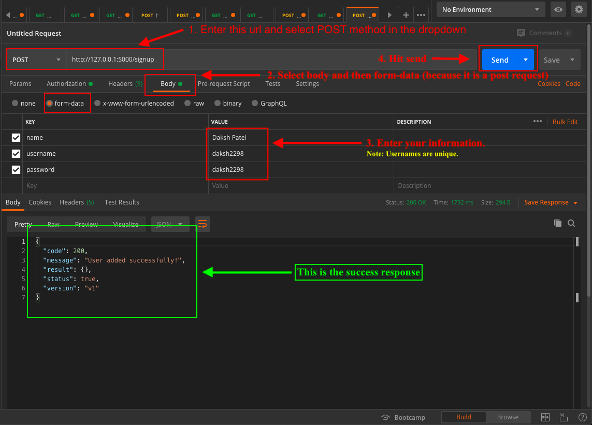
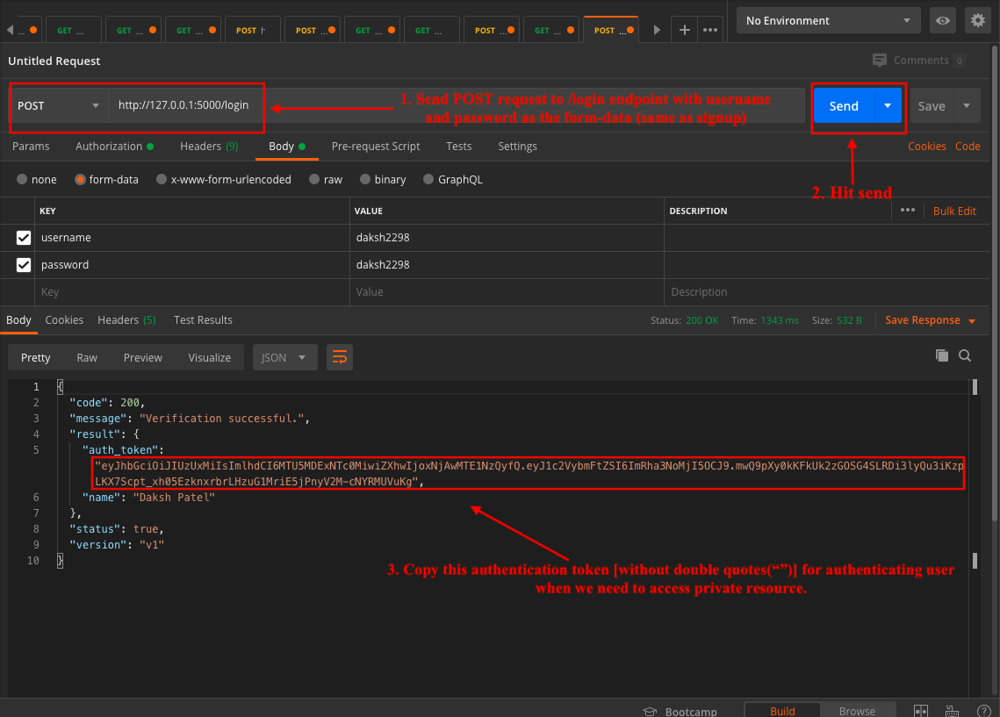
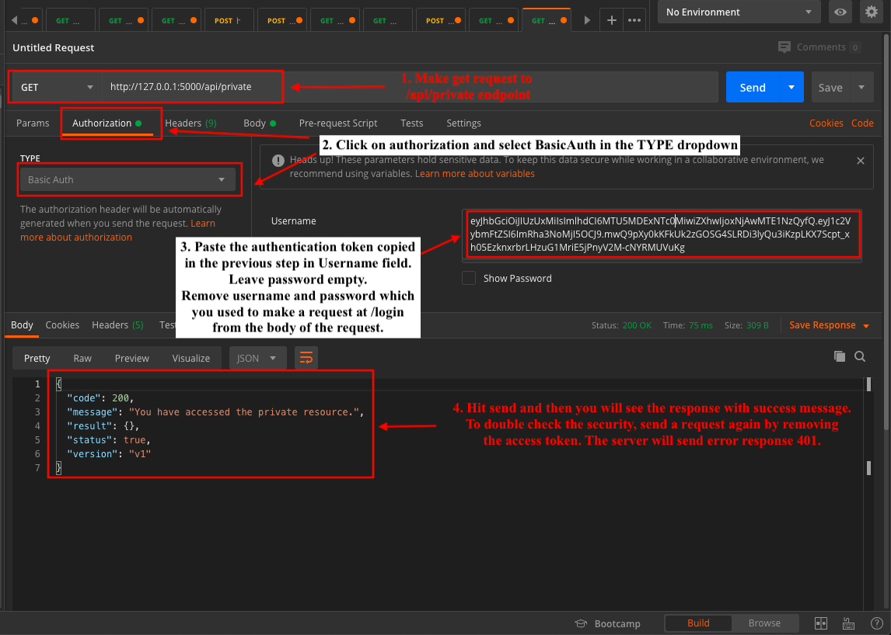

# Authentication_Demo
#### This is sample application for basic HTTP authentication in Flask API

##### This project requires python 3.7.3 or later.

#### Structure of the project
```bash
├── imgs
├── project
│   ├── user
│   │   ├── __init__.py
│   │   ├── controller.py
│   │   ├── models.py
│   ├── __init__.py
├── venv (create virtual environment and then install the dependencies from requirements.txt
├── .env (add env file here)  
└── .gitignore
├── app.py
├── README.md
├── requirements.txt
├── utils.py
```

###### We will use the flask_httpauth package in order to authentication the HTTP requests.

> To secure an endpoint, we use `@auth.login_required` decorator, which verifies the access token by calling "verify_password" method decorated by `@auth.verify_password`

Sample code:
```python
from flask import Flask
from flask_httpauth import HTTPBasicAuth

app = Flask(__name__)
auth = HTTPBasicAuth()

@auth.verify_password
def verify_password(username_or_token, password):
    """Verification login here"""


@app.route('/api/private')
@auth.login_required  
# This decorator verifies the authentication token in the request.
def private_resource():
    """Return the response"""


@app.route('/api/public')  
# This endpoint is not decorated by @auth.login_required and hence no authentication will be performed.
def public_resource():
    """Return the response"""
```

#### The above code is the sample code for http authentication. The same logic is used to build this API and the code is refactored in MVC format.


> As Flask is micro-framework, it does not provides MVC structure like Django (or Springboot in Java), hence I have enforced an MVC structure explicitly. Here, the modules in ./project directory are the entities and each module contains its own Model, and Controller (no View as it is an API).

For this demonstration, we are doing signup and login by user, followed by accessing the private and public resources.
> Note: This is the sample for authenticating user's request when they want to
> access the private resource. You can think of the private resource as the progress of the user 
> received by the user or user's dashboard. Public resource can be the price of the course.  

#### To run the API, clone this repo, 
1. Run `cd Authentication_Demo`.
2. Create virtual environment.
    1. On macOS or linux:
       `python3 -m venv venv` <br>
       or on windows:
       `py -m venv venv`
3. Activate virtual environment.
    1. On macOS and Linux: `source env/bin/activate` <br>
        or on windows:
        `.\env\Scripts\activate`
4. Run `pip install -r requirements.txt`
5. Run `python app.py`

#### To test the api, download [postman](https://www.postman.com/downloads/).

1. First we need to signup, so we need to make a POST request on `/signup` endpoint. Please the image below.

2. Followed by signup, now we will login by sending the POST request to `/login` endpoint and get the authentication token on successful login. Please refer the image below.

3. Copy the authentication token received in the response to access the private resource of the API on the endpoint `/api/private`. Please refer the image below.
    
    
    > Note: In the above request to /api/private, we do not use username or password. 
    > The authentication (JWT) token received at successful login contains the username, 
    > which authenticates the user to access the private resource.   
4. Repeat step 3 by making request and `/api/public` without adding the authentication token in the authorization (username). <br>
You will get the success response because it is the public resource and does not requires access resource.

